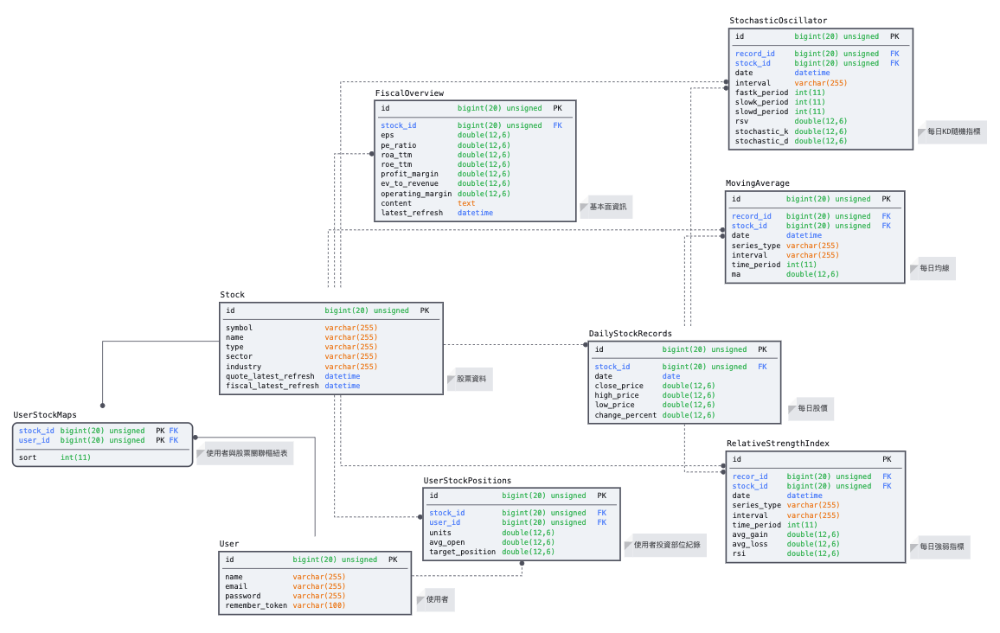

[](https://github.com/navendu-pottekkat/virtual-drums/issues)

### 什麼是Power Portfolio?

為了節省每天看盤的時間所設計的一款結合股價、技術指標、基本面資訊、個人資產盈虧的美股長期績效投資工具，省去每次看盤都需要輸入代號及參數進看盤軟體等操作，每天只需要短短的時間便可以瀏覽所有股票的近期走勢

本專案後端採用Laravel框架、PHP，前端畫面使用Bootstrap、Javascript、CSS、HTML做開發

股價更新資料來源於Alpha Vantage、Yahoo Finance

### 目錄
- 安裝
- 功能
- 如何開始
- 使用說明
- 資料庫架構
- 發展
- 貢獻

### 安裝

- 載入相依套件
    - `composer install`
    
- 產生.env檔案
    - `cp .example.env .env`
    
- 執行資料庫遷移
    - `php artisan migrate`
    
- 創建加密需要公鑰以及私鑰
    - `php artisan passport:install`

### 功能
- [x] 會員註冊&登入
- [x] 每日更新收盤價&技術指標
- [x] 搜尋股票標的
- [x] 自訂股票觀察清單
- [x] 紀錄個人持有股票部位及計算損益
- [x] 觀察清單刪除股票
- [x] 觀察清單依照欄位做排序
- [x] 觀察清單分頁顯示
- [x] 股票基本面資訊
- [x] 技術指標圖形化
- [x] 動態止盈止損價顯示

### 如何開始?
- 申請一組Alpha Vantage API key 
    - [Alpha Vantage](https://www.alphavantage.co/support/#api-key)

- 將API key放入.env
    - ```ALPHA_VANTAGE_KEY=XXXXXXXXXXXXX```
- 產生初始股票標資料
    - `php artisan init:data --file_path=app/Form/stock_symbols_01.xlsx`

### 使用說明
- 必須於每個收盤日結束時更新所有股價、技術指標及基本面資訊:
    - `php artisan sync:new_record`


### 資料庫架構


### 貢獻


